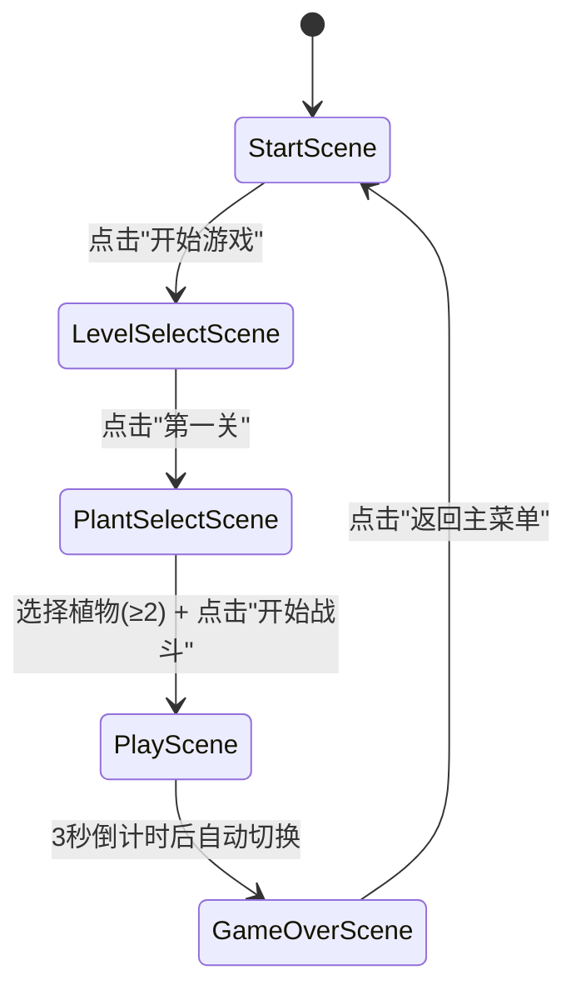

# Plants vs Zombies — 软件架构设计文档

> **版本**: 1.0  
> **技术栈**: Java 25 + JavaFX 25 + Maven  
> **模块系统**: `module-info.java`（命名模块 `org.bxh.pvz`）  
> **架构模型**: Entity Component System (ECS) + Event Driven Architecture + Data Driven Design

---

## 1. 项目概述

### 1.1 游戏类型

2D 塔防游戏 — 植物大战僵尸（Plants vs Zombies）的 Java 实现。玩家在草坪网格上种植植物，抵御从右侧来袭的僵尸。

### 1.2 技术栈

| 层级 | 技术 |
|------|------|
| 语言 | Java 25 |
| UI 框架 | JavaFX 25 (Canvas + GraphicsContext) |
| 构建 | Maven |
| 模块系统 | Java Module System (`org.bxh.pvz`) |
| 核心特性 | sealed interface, record, pattern matching switch, var |

### 1.3 架构目标

- **可扩展** — 新增植物/僵尸/关卡只需追加数据配置和组件参数，不改架构
- **可测试** — 每个 System 独立可测，Entity 无逻辑纯数据
- **数据驱动** — 植物参数、僵尸参数、关卡波次全部配置化
- **性能可接受** — 30 个实体级别下的 ECS 完全满足 60fps

### 1.4 为什么选择 ECS

传统 OOP 塔防游戏使用 `Plant → Peashooter` 继承链，导致：

- 植物行为分散在继承树的各个层级
- 新增植物类型需要新建子类
- 植物与僵尸的行为耦合在类方法中
- 难以实现"向日葵既能产阳光又能当肉盾"这类交叉行为

ECS 将对象拆解为 Entity（ID） + Component（数据） + System（行为）：

- **Entity** — 纯 ID 容器，不包含任何业务逻辑
- **Component** — 纯数据持有，无方法逻辑（仅数据访问器）
- **System** — 遍历拥有特定组件组合的实体，执行行为

Peashooter、Sunflower 的区别仅在于组合了哪些 Component 及各参数值——而非继承不同子类。

### 1.5 为什么使用事件驱动

游戏中的跨系统通信（种植植物、阳光变化、游戏结束）通过 `EventBus` 解耦：

- InputManager 发布 `PlantPlaced` 事件，无需知道谁处理种植
- SceneManager 订阅 `PlantPlaced` 创建 PlantEntity
- CombatSystem 专注于战斗，不关心阳光
- SunSystem 管理资源，不关心僵尸波次

事件在每帧开始时统一分发，避免帧内状态不一致。

### 1.6 数据驱动设计

所有数值参数集中在 `config` 包：

- `PlantConfig` — 植物价格、生命、攻击力、冷却、产阳光间隔、外观
- `LevelConfig` / `WaveData` — 关卡波次、僵尸数量、生成间隔
- `GameConfig` — 窗口尺寸、网格行列、格子大小

`PlantEntity.create(PlantConfig, row, col, x, y)` 根据配置创建实体。新增植物类型只需新增一个 `PlantConfig` 静态工厂方法，无需编写新类。

---

## 2. 总体架构设计

### 2.1 模块结构

```
org.bxh.pvz
├── bootstrap/  ← JavaFX Application 入口
├── core/       ← Game 编排器、GameLoop、GameRenderer
├── scene/      ← 场景管理器 + 5 个场景实现
├── ecs/
│   ├── component/  ← 6 个 Component（纯数据）
│   ├── entity/     ← Entity 基类 + PlantEntity + ZombieEntity
│   └── system/     ← 8 个 System（全部行为逻辑）
├── gameplay/   ← 游戏玩法实体（BulletEntity, SunEntity, LawnMowerEntity）
├── world/      ← GameWorld（实体容器）+ GridMap（网格坐标）
├── event/      ← EventBus + sealed GameEvent
├── input/      ← InputManager（鼠标拖拽种植）
├── config/     ← PlantConfig, LevelConfig, WaveData, GameConfig
└── resource/   ← AssetLoader + TextureManager
```

### 2.2 架构全景图

```mermaid
graph TD
    subgraph "入口层"
        APP[GameApplication]
    end

    subgraph "场景层 (scene/)"
        SM[SceneManager]
        SS[StartScene]
        LS[LevelSelectScene]
        PS[PlantSelectScene]
        GS[PlayScene]
        GO[GameOverScene]
    end

    subgraph "核心层 (core/)"
        GAME[Game]
        RENDERER[GameRenderer]
    end

    subgraph "ECS 系统层 (ecs/system/)"
        MS[MovementSystem]
        CS[CombatSystem]
        CLS[CollisionSystem]
        SUN[SunSystem]
        WAVE[WaveSystem]
        LM[LawnMowerSystem]
        GOS[GameOverSystem]
        RS[RenderSystem]
    end

    subgraph "ECS 实体层 (ecs/entity/ + gameplay/)"
        E[Entity]
        PLANT[PlantEntity]
        ZOMBIE[ZombieEntity]
        BULLET[BulletEntity]
        SUN_E[SunEntity]
        MOWER[LawnMowerEntity]
    end

    subgraph "ECS 组件层 (ecs/component/)"
        TF[TransformComponent]
        HP[HealthComponent]
        MV[MovementComponent]
        ATK[AttackComponent]
        REN[RenderComponent]
    end

    subgraph "世界层 (world/)"
        GW[GameWorld]
        GM[GridMap]
    end

    subgraph "事件层 (event/)"
        EB[EventBus]
        GE[GameEvent]
    end

    subgraph "输入层"
        IM[InputManager]
    end

    subgraph "配置层 (config/)"
        GC[GameConfig]
        PC[PlantConfig]
        LC[LevelConfig]
        WD[WaveData]
    end

    APP -->|创建| SM
    SM -->|切换| SS
    SM -->|切换| LS
    SM -->|切换| PS
    SM -->|切换| GS
    SM -->|切换| GO
    SM -->|持有| GAME
    SM -->|持有| GW
    SM -->|持有| EB
    SM -->|持有| SUN

    GAME -->|update| MS
    GAME -->|update| CS
    GAME -->|update| CLS
    GAME -->|update| SUN
    GAME -->|update| WAVE
    GAME -->|update| LM
    GAME -->|update| GOS
    GAME -->|render| RENDERER

    GAME -->|持有| GW
    GAME -->|持有| EB
    GAME -->|持有| IM

    MS -->|操作| GW
    CS -->|操作| GW
    CLS -->|操作| GW
    SUN -->|操作| GW
    WAVE -->|操作| GW
    LM -->|操作| GW
    GOS -->|操作| GW

    GW -->|管理| E
    PLANT -.->|继承| E
    ZOMBIE -.->|继承| E
    BULLET -.->|继承| E
    SUN_E -.->|继承| E
    MOWER -.->|继承| E

    E -->|组合| TF
    E -->|组合| HP
    E -->|组合| MV
    E -->|组合| ATK
    E -->|组合| REN

    EB -->|分发| GE
    IM -->|发布| EB
    GS -->|订阅| EB
    GOS -->|发布| EB

    GC --> GM
    PC --> PLANT
    LC --> WAVE

    style APP fill:#4a7c3f,color:#fff
    style GAME fill:#5a8f4a,color:#fff
    style SM fill:#3a6b2f,color:#fff
    style EB fill:#8a6b2a,color:#fff
```



### 2.3 数据流

```
用户点击植物卡片并拖拽到草坪
  → InputManager.onMouseReleased()
    → sunSystem.spendSun(price)
    → eventBus.publish(PlantPlaced)
    
下一帧：
  → Game.update()
    → eventBus.dispatch()
      → PlayScene.onPlantPlaced()
        → PlantEntity.create(cfg, row, col, x, y)
        → world.spawnEntity(plant)

同帧渲染：
  → Game.render()
    → 遍历 world.entities()
    → 对有 RenderComponent + TransformComponent 的实体调用 renderer.drawRect/drawCircle
```

### 2.4 帧循环

```
┌─────────────────────────────────────────────────────┐
│  GameApplication AnimationTimer.handle(nanos)       │
│                                                     │
│  1. deltaTime = (now - last) / 1e9                  │
│  2. sceneManager.update(dt)                         │
│     └─ currentScene.update(dt)                      │
│        └─ PlayScene.update(dt)                      │
│           └─ game.update(dt)                        │
│              ├─ eventBus.dispatch()    ← 分发事件   │
│              ├─ input.processPending() ← 消费输入   │
│              ├─ world.processPending() ← 实体增删   │
│              └─ systems.forEach(update)← 逻辑更新   │
│  3. sceneManager.render(renderer)                   │
│     └─ currentScene.render(renderer)                │
│        └─ PlayScene.render(renderer)                │
│           ├─ game.render(renderer)                  │
│           │  ├─ 清屏                              │
│           │  ├─ 绘制顶部栏                         │
│           │  ├─ 绘制网格                           │
│           │  ├─ 遍历实体绘制                       │
│           │  ├─ 绘制植物卡片                       │
│           │  └─ 绘制拖拽幽灵                       │
│           ├─ 绘制阳光计数                           │
│           └─ 绘制结果遮罩                           │
└─────────────────────────────────────────────────────┘
```

---

## 3. ECS 架构详解

### 3.1 Entity

```java
// org.bxh.pvz.ecs.entity.Entity
public class Entity {
    private final UUID id;
    private final Map<Class<?>, Component> components;
    private boolean active;

    public <T extends Component> Optional<T> getComponent(Class<T> type);
    public <T extends Component> void addComponent(T component);
    public boolean hasComponent(Class<? extends Component> type);
    // ...
}
```

Entity 是纯 ID 容器。通过 `ConcurrentHashMap<Class<?>, Component>` 管理组件集合。不包含任何游戏逻辑。

**关键设计**：`getComponent(Class<T>)` 返回 `Optional<T>`，强迫调用方处理组件缺失的情况，避免 NPE。

### 3.2 Component

```java
// org.bxh.pvz.ecs.component.Component
public sealed interface Component
    permits TransformComponent, HealthComponent,
            MovementComponent, AttackComponent, RenderComponent {}
```

5 个组件，通过 `sealed interface` 约束编译期完整：

| Component | 类型 | 数据 |
|-----------|------|------|
| `TransformComponent` | record (不可变) | x, y, rotation, scaleX, scaleY |
| `HealthComponent` | class (可变) | currentHealth, maxHealth |
| `MovementComponent` | class (可变) | velocityX, velocityY, speed |
| `AttackComponent` | class (可变) | damage, attackRange, attackCooldown, cooldownTimer |
| `RenderComponent` | class (可变) | shapeType, width, height, colorHex, visible |

**不可变 vs 可变**：
- `TransformComponent` 为 `record` —— 位置变化通过 `withPosition(x,y)` 创建新实例后替换
- `HealthComponent`、`MovementComponent`、`AttackComponent` 为普通 `class` —— 内部状态由 System 直接修改
- 在实体数量 < 200 的量级下，record 替换的 GC 开销可忽略

### 3.3 System

```java
// org.bxh.pvz.ecs.system.GameSystem
public sealed interface GameSystem
    permits MovementSystem, CombatSystem, CollisionSystem,
            RenderSystem, SunSystem, LawnMowerSystem,
            WaveSystem, GameOverSystem {

    void update(double deltaTime, GameWorld world);
}
```

8 个系统通过 `sealed interface` 约束：

| System | 职责 | 处理的 Archetype |
|--------|------|-----------------|
| `MovementSystem` | 根据 `MovementComponent` 更新位置 | Transform + Movement |
| `CombatSystem` | 植物射击（发射子弹）、僵尸近战（伤害植物）、停止/恢复移动 | Plant + Attack / Zombie + Attack |
| `CollisionSystem` | 子弹 AABB 命中僵尸 | Bullet × Zombie |
| `SunSystem` | 向日葵产阳光、天空掉落、管理阳光资源 | Plant(sunflower) / Sun |
| `LawnMowerSystem` | 小推车触发→加速→碾压僵尸 | LawnMower × Zombie |
| `WaveSystem` | 按 LevelConfig 波次生成僵尸 | — |
| `GameOverSystem` | 检测僵尸到达房屋线 / 波次全部清除 | Zombie |
| `RenderSystem` | 遍历实体绘制形状 | Transform + Render |

**执行顺序**（Game.update 中）：

1. EventBus.dispatch()
2. InputManager.processPending()
3. GameWorld.processPending()
4. MovementSystem → CombatSystem → CollisionSystem → SunSystem → WaveSystem → LawnMowerSystem → GameOverSystem

渲染阶段独立于逻辑帧，渲染时仅遍历实体绘制。

### 3.4 Entity 子类型

`PlantEntity`、`ZombieEntity`、`BulletEntity`、`SunEntity`、`LawnMowerEntity` 均继承 `Entity`，但**不通过继承定义行为**：

```java
// PlantEntity 使用工厂方法 + 组件组合
public static PlantEntity create(PlantConfig cfg, int row, int col, double x, double y) {
    PlantEntity entity = new PlantEntity(cfg, row, col);
    entity.addComponent(TransformComponent.at(x, y));
    entity.addComponent(new HealthComponent(cfg.maxHealth()));
    if (cfg.damage() > 0)
        entity.addComponent(new AttackComponent(cfg.damage(), cfg.attackRange(), cfg.attackCooldown()));
    entity.addComponent(new RenderComponent(cfg.shapeType(), cfg.width(), cfg.height(), cfg.colorHex()));
    return entity;
}
```

Peashooter 与 Sunflower 的区别仅在于 `PlantConfig` 参数不同——Peashooter 有 `AttackComponent`，Sunflower 有 `sunInterval`。

---

## 4. 事件系统

### 4.1 GameEvent

```java
public sealed interface GameEvent
    permits GameEvent.ZombieKilled, GameEvent.PlantPlaced,
            GameEvent.GameStarted, GameEvent.GameOver,
            GameEvent.SunCollected, GameEvent.LevelComplete {

    record ZombieKilled(UUID zombieId, double x, double y) implements GameEvent {}
    record PlantPlaced(UUID plantId, String plantType, int row, int col) implements GameEvent {}
    record GameStarted() implements GameEvent {}
    record GameOver(boolean victory) implements GameEvent {}
    record SunCollected(int amount) implements GameEvent {}
    record LevelComplete() implements GameEvent {}
}
```

6 种事件类型，通过 `sealed interface` + `record` 组合。`record` 保证事件不可变，`sealed` 保证编译期穷举检查。

### 4.2 EventBus

```java
public final class EventBus {
    private final ConcurrentHashMap<Class<?>, CopyOnWriteArrayList<Consumer<GameEvent>>> subscribers;
    private final Queue<GameEvent> pending;

    public void publish(GameEvent event);                        // 入队
    public <T extends GameEvent> void subscribe(Class<T> type, Consumer<T> handler);
    public void dispatch();                                      // 每帧分发
}
```

- 线程安全：`ConcurrentHashMap` + `CopyOnWriteArrayList` + `ConcurrentLinkedQueue`
- 延迟分发：`publish()` 入队，`dispatch()` 统一出队——避免帧内状态不一致
- 每帧 `Game.update()` 开头调用 `dispatch()`，一帧内发布的事件在下帧处理

### 4.3 事件流示例

```
InputManager.onMouseReleased()
  → eventBus.publish(PlantPlaced)
    → pending.offer(event)

--- 下一帧 ---

Game.update()
  → eventBus.dispatch()
    → PlayScene.onPlantPlaced(event)
      → PlantEntity.create(cfg, row, col, x, y)
      → world.spawnEntity(plant)
```

---

## 5. 场景管理

### 5.1 GameScene

```java
public sealed interface GameScene
    permits SceneManager.StartScene, SceneManager.LevelSelectScene,
            SceneManager.PlantSelectScene, SceneManager.PlayScene,
            SceneManager.GameOverScene {

    void onEnter(SceneContext ctx);
    void update(double dt);
    void render(GameRenderer renderer);
    void onMousePressed(MouseEvent e);
    void onMouseReleased(MouseEvent e);
    void onMouseDragged(MouseEvent e);
    void onExit();
}
```

5 个场景实现为 `SceneManager` 的静态内部类（非 record，以支持可变状态）。

### 5.2 场景状态机



`SceneContext` 在场景间传递数据：`selectedPlants`、`gameOverVictory`。

### 5.3 PlayScene 初始化

```java
public void onEnter(SceneContext ctx) {
    GameWorld world = new GameWorld(gridMap);
    EventBus eventBus = new EventBus();
    SunSystem sunSystem = new SunSystem(eventBus, initialSun);
    InputManager inputManager = new InputManager(config, eventBus, gridMap, sunSystem, selectedPlants);
    WaveSystem waveSys = new WaveSystem(levelConfig);
    GameOverSystem gameOver = new GameOverSystem(eventBus, waveSys);
    Game game = new Game(config, world, eventBus, inputManager, sunSystem, waveSys, gameOver);

    // 订阅 PlantPlaced -> 创建植物
    eventBus.subscribe(GameEvent.PlantPlaced.class, ev -> onPlantPlaced(ev, world, gridMap));

    // 生成 5 辆小推车（每行一辆）
    for (int r = 0; r < 5; r++)
        world.spawnEntity(LawnMowerEntity.create(r, gridMap.offsetX() - 30, gridMap.cellToScreenY(r)));
}
```

PlayScene 退出时，Game 随 SceneManager 切换被 GC 回收——无需显式清理。

---

## 6. 核心系统实现细节

### 6.1 CombatSystem

**植物射击**：遍历 `PlantEntity`，调用 `findNearestZombieInRow()` 找同行最近僵尸，冷却完毕则 `spawnEntity(BulletEntity)`。

```java
// 关键：植物只攻击同行(dy<30px)且前方(dx>0)的僵尸
Entity findNearestZombieInRow(PlantEntity plant, GameWorld world) {
    for (Entity e : world.entities()) {
        if (!(e instanceof ZombieEntity zombie)) continue;
        double dx = zombieX - plantX;
        double dy = Math.abs(zombieY - plantY);
        if (dx > 0 && dx <= attackRange && dy < ROW_TOLERANCE && dx < bestDist) {
            bestDist = dx; best = zombie;
        }
    }
}
```

**僵尸近战**：遍历 `ZombieEntity`，调用 `findPlantInMeleeRange()` 找 50px 内植物，冷却完毕则 `health.takeDamage(20)`。**进入近战范围后，设置 `MovementComponent.setVelocity(0,0)` 停止移动，植物死亡后恢复 `setVelocity(-speed, 0)`**。

### 6.2 CollisionSystem

子弹 × 僵尸双层遍历，AABB 重叠检测：

```java
double dx = Math.abs(bulletX - zombieX);
double dy = Math.abs(bulletY - zombieY);
if (dx < (bulletW + zombieW) / 2 && dy < (bulletH + zombieH) / 2) {
    zombie.getComponent(HealthComponent.class)
        .ifPresent(hp -> hp.takeDamage(bullet.damage()));
    world.destroyEntity(bullet);
}
```

### 6.3 SunSystem

- **向日葵产阳光**：每 `sunInterval`（6s）从向日葵位置 `spawnEntity(SunEntity.fromSunflower(x, y))`
- **天空掉落**：每 8-15s 从随机 x 位置 `spawnEntity(SunEntity.fromSky(x))`
- **点击收集**：PlayScene.onMousePressed() 遍历检测 SunEntity 命中，20px 范围判定
- **到达地面消失**：y > 650 的 SunEntity 自动 destroy

### 6.4 WaveSystem

按 `LevelConfig.waves[]` 列表顺序生成僵尸：

```java
// level1: 3波
Wave 1: 3只, 间隔12s, 延迟2s
Wave 2: 5只, 间隔10s, 延迟20s
Wave 3: 8只, 间隔8s,  延迟20s
```

每波僵尸数量达到后自动进入下一波，3 波全部生成完毕后 `allWavesDone = true`。

### 6.5 LawnMowerSystem

三态状态机：`READY → RUNNING → USED`

- **READY**：静止等待，`velocityX=0`
- **触发**：同行的 `ZombieEntity` 的 `transform.x < 150` → 切换 `RUNNING`，`setVelocity(400, 0)`
- **碾压**：移动过程中与该行僵尸 AABB 重叠 → `destroyEntity(zombie)`
- **出界**：`transform.x > 1100` → 切换 `USED`，`setActive(false)`

### 6.6 GameOverSystem

- **失败条件**：任意 `ZombieEntity` 的 `transform.x < 80`（房屋线）→ `publish(GameOver(false))`
- **胜利条件**：`waveSystem.allWavesDone() && countActiveZombies == 0` → `publish(LevelComplete())`

---

## 7. 数据配置层

### 7.1 PlantConfig

```java
public record PlantConfig(
    String type,          // "peashooter" | "sunflower" | "wallnut"
    String displayName,   // UI 显示名
    int price,            // 阳光消耗
    double maxHealth,
    double damage,        // 0 = 无攻击力
    double attackRange,
    double attackCooldown,
    double sunInterval,   // 0 = 不产阳光
    String colorHex,      // 当前使用纯色，后续替换为纹理 key
    double width, double height,
    ShapeType shapeType
) {}
```

**当前 Level 1 植物数据**：

| 植物 | price | HP | damage | range | cooldown | sunInterval | 外观 |
|------|-------|-----|--------|-------|----------|-------------|------|
| Peashooter | 100 | 100 | 15 | 350 | 0.7s | — | 绿竖条 24×44 |
| Sunflower | 50 | 80 | — | — | — | 6s | 黄圆 36×36 |
| Wallnut | 50 | 400 | — | — | — | — | 棕圆角 40×40 |

### 7.2 LevelConfig

```java
public record LevelConfig(int totalWaves, List<WaveData> waves, double initialSun) {}
public record WaveData(int zombieCount, double spawnInterval, double delayBeforeWave) {}
```

### 7.3 GameConfig

```java
public record GameConfig(
    int windowWidth, int windowHeight,  // 1024 × 768
    String windowTitle,
    int gridRows, int gridCols,         // 5 × 9
    int cellSize,                       // 80px
    int topBarHeight                    // 90px
) {}
```

`gridOffsetX()` / `gridOffsetY()` 自动计算居中偏移。

---

## 8. 输入系统

### 8.1 InputManager

```java
public record PlantCard(String plantType, String label, int price,
                        double x, double y, double w, double h) {}
```

**拖拽流程**：

1. `onMousePressed` → 检测是否在 `PlantCard` 区域内 → 设置 `dragging=true`, `dragPlantType`
2. `onMouseDragged` → 更新 `mouseX`, `mouseY`（用于幽灵渲染）
3. `onMouseReleased` → `screenToGrid(e.x, e.y)` → 检查 `sunSystem.spendSun(price)` → 成功则 `pendingActions.add(publish(PlantPlaced))`
4. 下一帧 `processPending()` 执行所有待处理动作

**阳光点击**：PlayScene.onMousePressed() 中优先检测 SunEntity 命中（20px 范围），收集后返回——不进入 InputManager 逻辑。

---

## 9. 渲染系统

### 9.1 GameRenderer

场景渲染委托给 `GameRenderer`，而非 System：

```java
// Game.render()
public void render(GameRenderer renderer) {
    renderer.clear();
    renderer.drawTopBar();          // 顶部栏背景 + 分隔线
    renderer.drawGrid(world.gridMap()); // 草坪 + 网格线
    for (Entity e : world.entities()) { // 直接遍历实体绘制
        // 根据 RenderComponent.shapeType 调用 renderer.drawRect/drawCircle/drawRoundedRect
    }
    renderer.drawPlantCards(cards); // 植物卡片 + 图标 + 价格
    renderer.drawDragGhost(...);    // 拖拽时半透明预览
}
```

### 9.2 后续替换精灵图

当前使用纯色几何图形（`fillRect` / `fillOval` + `Color.web(hex)`）。替换精灵图时只需：

1. `TextureManager` 注册纹理 `textureManager.register("peashooter", new Image(...))`
2. `PlantConfig.colorHex` 改为纹理 key（如 `"peashooter_sprite"`）
3. `GameRenderer` 对应 `draw*` 方法改为 `gc.drawImage(textureManager.get(key), ...)`

System 层和 Entity 层无需任何改动。

---

## 10. 资源系统

### 10.1 AssetLoader

统一的资源发现与加载入口。当前为同步加载，后续可扩展异步加载 + 缓存。

### 10.2 TextureManager

运行时纹理缓存，基于 key 存取 `javafx.scene.image.Image`。为后续精灵图系统做准备。

---

## 11. 目录结构

```
pvz/
├── pom.xml
├── module-info.java
├── docs/
│   └── ARCHITECTURE.md
├── src/main/java/
│   └── org/bxh/pvz/
│       ├── bootstrap/
│       │   └── GameApplication.java       # JavaFX Application 入口
│       ├── config/
│       │   ├── GameConfig.java            # 窗口 + 网格配置
│       │   ├── PlantConfig.java           # 植物数据配置
│       │   ├── LevelConfig.java           # 关卡配置
│       │   └── WaveData.java              # 波次数据
│       ├── core/
│       │   ├── Game.java                  # 游戏编排器
│       │   ├── GameLoop.java              # AnimationTimer 封装
│       │   └── GameRenderer.java          # Canvas 2D 渲染器
│       ├── scene/
│       │   ├── GameScene.java             # 场景接口 (sealed)
│       │   ├── SceneContext.java          # 场景上下文
│       │   └── SceneManager.java          # 场景管理器 + 5个场景实现
│       ├── ecs/
│       │   ├── component/
│       │   │   ├── Component.java         # 组件接口 (sealed)
│       │   │   ├── TransformComponent.java
│       │   │   ├── HealthComponent.java
│       │   │   ├── MovementComponent.java
│       │   │   ├── AttackComponent.java
│       │   │   └── RenderComponent.java
│       │   ├── entity/
│       │   │   ├── Entity.java            # 实体基类
│       │   │   ├── PlantEntity.java       # 植物实体 + 工厂方法
│       │   │   └── ZombieEntity.java      # 僵尸实体 + 工厂方法
│       │   └── system/
│       │       ├── GameSystem.java        # 系统接口 (sealed)
│       │       ├── MovementSystem.java
│       │       ├── CombatSystem.java
│       │       ├── CollisionSystem.java
│       │       ├── SunSystem.java
│       │       ├── WaveSystem.java
│       │       ├── LawnMowerSystem.java
│       │       ├── GameOverSystem.java
│       │       └── RenderSystem.java
│       ├── gameplay/
│       │   ├── BulletEntity.java          # 子弹实体
│       │   ├── SunEntity.java             # 阳光实体
│       │   └── LawnMowerEntity.java       # 小推车实体
│       ├── world/
│       │   ├── GameWorld.java             # 实体容器
│       │   └── GridMap.java               # 网格坐标系统
│       ├── event/
│       │   ├── EventBus.java              # 事件总线
│       │   └── GameEvent.java             # 事件定义 (sealed)
│       ├── input/
│       │   └── InputManager.java          # 拖拽种植 + 卡片管理
│       └── resource/
│           ├── AssetLoader.java           # 资源加载器
│           └── TextureManager.java        # 纹理管理器
└── src/main/resources/
    └── config/
        └── level1.json                    # 关卡配置（预留）
```

---

## 12. 扩展指南

### 12.1 新增植物

```java
// 1. PlantConfig 新增静态工厂
public static PlantConfig snowPea() {
    return new PlantConfig("snowpea", "寒冰射手", 175, 100, 15, 350, 0.7, 0,
            "#64B5F6", 24, 44, ShapeType.RECT);
}

// 2. PlantSelectScene 卡片列表追加
static final List<PlantCard> CARDS = List.of(
    new PlantCard("peashooter", "豌豆射手", 100, "#4CAF50"),
    new PlantCard("sunflower", "向日葵", 50, "#FFD700"),
    new PlantCard("wallnut", "坚果墙", 50, "#8D6E63"),
    new PlantCard("snowpea", "寒冰射手", 175, "#64B5F6"),  // ← 新增
);

// 3. PlayScene.onPlantPlaced 的 switch 追加
case "snowpea" -> PlantConfig.snowPea();
```

无需新建类，无需修改 System。

### 12.2 新增僵尸

同植物——在 `ZombieEntity` 新增工厂方法，`PlantConfig` 追加配置。

### 12.3 新增关卡

```java
public static LevelConfig level2() {
    return new LevelConfig(5, List.of(
        new WaveData(5, 10.0, 3.0),
        new WaveData(8, 8.0, 15.0),
        new WaveData(10, 6.0, 15.0),
        new WaveData(12, 5.0, 15.0),
        new WaveData(15, 4.0, 15.0)
    ), 100);
}

// LevelSelectScene 新增关卡卡片
```

### 12.4 新增 System

```java
// 1. 实现 GameSystem
public final class FreezeSystem implements GameSystem {
    @Override public void update(double dt, GameWorld world) { ... }
}

// 2. GameSystem.java permits 列表追加
public sealed interface GameSystem permits ..., FreezeSystem {}

// 3. Game.java logicSystems 列表追加
```

### 12.5 新增 Component

```java
// 1. 实现 Component
public final class FreezeComponent implements Component { ... }

// 2. Component.java permits 列表追加
public sealed interface Component permits ..., FreezeComponent {}
```

---

## 13. 设计模式映射

| 模式 | 应用位置 | 说明 |
|------|---------|------|
| Component | `Component` sealed interface | ECS 的 "C"：数据载体 |
| Entity | `Entity` | ECS 的 "E"：ID 容器 |
| System | `GameSystem` sealed interface | ECS 的 "S"：行为 |
| Factory Method | `PlantEntity.create()`, `ZombieEntity.create*()` | 根据配置创建不同实体 |
| Observer | `EventBus` + `subscribe/publish` | 发布/订阅解耦 |
| State | `LawnMowerEntity.State(READY/RUNNING/USED)` | 小推车状态机 |
| State | `GameScene` (5个场景) | 场景状态机 |
| Facade | `Game` | 屏蔽 ECS/事件/输入复杂性 |
| DI (手动) | `Game` 构造函数 | 手动注入所有依赖 |
| Sealed Type Hierarchy | `GameEvent`, `Component`, `GameSystem`, `GameScene` | 编译期穷举检查 |
| Value Object | `TransformComponent` (record) | 不可变位置 |
| Immutable Config | `GameConfig`, `PlantConfig`, `LevelConfig` (record) | 配置不可变 |
| Adapter | `InputManager` | JavaFX 鼠标事件 → 游戏域事件 |
| Cache | `TextureManager` | 纹理运行时缓存 |
| Game Loop | `AnimationTimer` → `Game.update/render` | 固定时间步更新 |

---

## 14. 关键约束

1. **Entity 不含逻辑** — 所有行为在 System 中
2. **System 不持有 Entity 引用** — 通过 `GameWorld` 查询
3. **Component 不引用其他 Component** — 数据完全扁平
4. **Event 是唯一跨系统通信方式** — 不直接调用其他 System
5. **禁止深层继承** — PlantEntity/ZombieEntity 只继承 Entity，不进一步子类化
6. **所有数值参数配置化** — 不得在 System 中硬编码数值
7. **渲染使用外部 renderer** — 不创建独立 Canvas